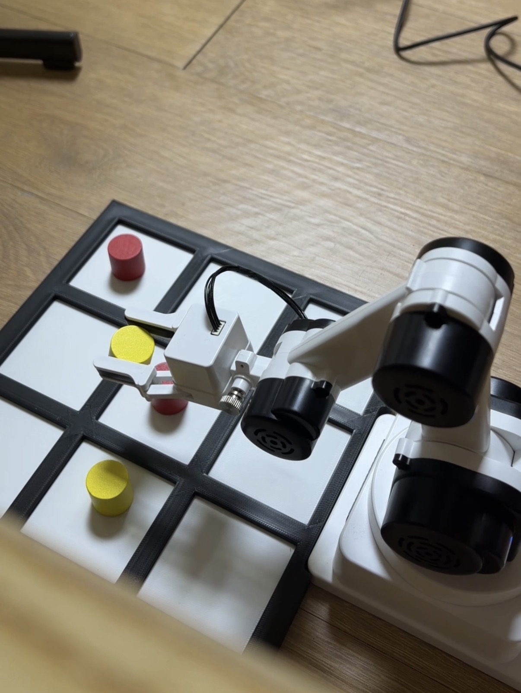

# RaccoonBot Vision Three-in-a-Row

[](https://github.com/Anhyeonseo/Raccoonbot-Vision-Three-in-a-row/actions/workflows/tests.yml)

Jetson Orin Nano, RGB 카메라와 4축 RaccoonBot으로 구현한 **3개 말 이동형
3목 체험 시스템**입니다. 참가자의 실제 수를 카메라로 읽고, 일부러 완벽하지 않게
설계한 AI가 다음 수를 선택하면 로봇팔이 빨강·노랑 말을 직접 집어서 옮깁니다.

초등학생·중학생 체험 부스를 목표로 하며, 별도의 클라우드나 ROS 없이 Jetson에서
게임·비전·로봇 제어를 모두 실행합니다. 노트북은 SSH 터널을 통해 운영 UI만
표시하므로 행사장 Wi-Fi가 없어도 USB-C 직결 네트워크로 운영할 수 있습니다.

## 시연

<p align="center">
  <a href="https://drive.google.com/file/d/1d0tjxeQ3BWgaXYCpIjII7FlVT4bhdUxd/view?usp=drive_link">
    
  </a>
</p>

<p align="center"><strong>이미지를 클릭하면 Google Drive 시연 영상이 열립니다.</strong></p>

### 운영 웹 UI

<p align="center">
  
</p>

새 미디어를 추가할 경로는 다음과 같습니다.

- 영상 썸네일: `assets/demo-thumbnail.jpg`
- 웹 UI 사진: `assets/web-ui.png`
- 영상 주소: 위 `<a href="...">`의 Google Drive URL

파일을 같은 이름으로 넣으면 README 수정 없이 이미지가 표시됩니다. 자세한 교체
방법은 [assets/README_KR.md](assets/README_KR.md)에 있습니다.

## 현재 상태

**부스 운영용 MVP와 실제 장비 최종 운반 시험을 완료했습니다.**

- 실제 카메라 기반 사람 수 인식과 로봇 동작 후 결과 재검증
- 배치 단계와 이동 단계를 포함한 실물 게임 완주
- 9개 셀과 3개 stock의 hover/grasp, `home`, `home_high`, `transit`: 총 27자세
- 말 하나를 `1→2→3→4→5→6→7→8→9`로 옮기는 무카메라 최종 시험 완주
- 모든 운반에서 높은 `transit` 경유 후 목표 칸 접근
- 직접 관절 이동 후 최대 오차 3° 검사, 실패 시 동일 자세 최대 2회 재전송
- 쉬움/보통 AI, 인식 재시도, 게임 중단, 화면 초기화와 현장 재캘리브레이션 UI
- 자동 테스트 **109개** 통과

현재 자세와 비전 설정은 실제 소형 보드·전용 카메라 거치대에서 검증했습니다.
카메라, 보드 또는 로봇의 상대 위치가 바뀌면 현장에서 다시 캘리브레이션하고
필요한 자세를 teaching해야 합니다.

## 게임 규칙

1. 참가자는 빨강 말 3개를 사용하고 선공합니다.
2. 참가자와 라쿤봇은 빈칸에 말을 하나씩 번갈아 배치합니다.
3. 가로·세로·대각선 3목이 만들어지면 즉시 승리합니다.
4. 말 6개가 모두 배치되면 이동 단계로 전환합니다.
5. 이동 단계에서는 자기 말 하나를 원하는 빈칸으로 옮깁니다. 인접 칸 제한은 없습니다.
6. 같은 보드와 차례가 3회 반복되거나 이동 단계가 10수를 넘으면 무승부입니다.

보드 번호는 사람에게 보이는 방향 기준으로 고정합니다.

```text
1 | 2 | 3
--+---+--
4 | 5 | 6
--+---+--
7 | 8 | 9
```

## 시스템 구성

```text
RGB Camera
    │
    ▼
원근 보정 · 빨강/노랑 9칸 판독
    │
    ▼
사람 행동 검증 · 3목 게임 상태기 · 불완전 AI
    │
    ▼
RaccoonBot pick-and-place
    │
    ▼
카메라 결과 재검증

노트북 브라우저 ◀── SSH tunnel ──▶ Jetson 운영 서버
```

주요 모듈은 다음처럼 나뉩니다.

- `game.py`, `strategy.py`: 규칙, 승패·반복 판정과 불완전 AI
- `vision/`: 원근 보정, 색상 판독, 프레임 안정화와 행동 추론
- `robot/`: 27개 teaching 자세, 안전 운반 경로와 공식 API 어댑터
- `app/`: 게임 세션, 웹 상태 제어와 현장 캘리브레이션
- `web/`: 노트북 브라우저용 운영 화면
- `tools/`: 설치 진단, 캘리브레이션, teaching과 실기 시험 CLI

## 검증한 장비 환경

| 항목 | 실제 검증 구성 |
|---|---|
| 컴퓨팅 | Jetson Orin Nano Developer Kit, 512GB NVMe |
| OS | Ubuntu 24.04.3 LTS, aarch64 |
| JetPack / L4T | JetPack 7.2.1 / L4T R39.2.1 |
| CUDA / OpenCV | CUDA 13.2 / OpenCV 4.8.0 |
| 카메라 | Trust QHD Webcam, MJPEG 1920×1080 30fps |
| 로봇 연결 | Mini Dongle+ USB 직렬, RaccoonBot BLE |
| 보드 / 말 | 고정형 흑백 3×3 소형 보드, 빨강·노랑 원통형 말 각 3개 |

위 버전은 **실제 검증 환경 기록**이며 모든 버전의 호환성을 보장한다는 의미는
아닙니다. RaccoonBot 자체 사용법과 주의사항은
[공식 RaccoonBot 사용자 가이드](https://github.com/RobomationLAB/RaccoonBot_Guide_KR)와
[Python API 매뉴얼](https://github.com/roboid-python/RaccoonBot_API_KR)을 함께 확인하세요.

## 빠른 시작: 데스크톱

Python 3.10 이상이 필요합니다. 카메라와 로봇 없이 규칙·AI·합성 비전·UI를
개발하거나 자동 테스트할 수 있습니다.

```bash
git clone https://github.com/Anhyeonseo/Raccoonbot-Vision-Three-in-a-row.git
cd Raccoonbot-Vision-Three-in-a-row
python3 -m venv .venv
source .venv/bin/activate
python -m pip install -U pip
python -m pip install -r requirements-desktop.txt
python -m pytest -q
```

대화형 규칙 시험과 자동 경기를 실행합니다.

```bash
raccoonbot-sim
raccoonbot-sim --games 1000 --seed 2026
```

하드웨어 없는 데스크톱 UI 데모:

```bash
raccoonbot-booth --windowed
```

더 자세한 데스크톱 도구는
[docs/DESKTOP_PREPARATION_KR.md](docs/DESKTOP_PREPARATION_KR.md)를 참고하세요.

## Jetson 배포

### 1. 시스템 준비

Jetson 플래시, NVMe, SSH, 카메라와 Mini Dongle+ 점검은
[docs/JETSON_BRINGUP_KR.md](docs/JETSON_BRINGUP_KR.md)의 순서로 진행합니다.
저장소를 Jetson에 준비한 뒤 읽기 전용 진단을 먼저 실행합니다.

```bash
bash scripts/jetson_probe.sh
```

### 2. Python 환경

JetPack의 OpenCV와 NumPy를 유지하기 위해 시스템 패키지를 사용하는 가상환경을
권장합니다.

```bash
python3 -m venv --system-site-packages .venv
source .venv/bin/activate
python -m pip install --no-deps -e .
python -c 'from robomation import RaccoonBot; print("robomation import OK")'
```

`robomation`과 Mini Dongle+ 준비는 공식 RaccoonBot 가이드에 따라 별도로
완료해야 합니다. 이 저장소는 해당 하드웨어 패키지를 재배포하지 않습니다.

### 3. 장비별 설정

다음 두 파일은 설치마다 달라지고 `.gitignore`에 포함되므로 저장소에 배포하지
않습니다.

- `config/robot_poses.json`: 실제 장비에서 teaching한 27개 관절 자세
- `config/vision.json`: 카메라, 보드 모서리와 빨강·노랑 HSV 설정

로봇 자세는 템플릿에서 시작합니다.

```bash
cp config/robot_poses.template.json config/robot_poses.json
raccoonbot-teach-pose home --capture-current
raccoonbot-validate-poses config/robot_poses.json
```

전체 teaching 순서와 주의사항은 [config/README_KR.md](config/README_KR.md),
현장 비전 설정은 [docs/BOOTH_UI_KR.md](docs/BOOTH_UI_KR.md)의 재캘리브레이션
절차를 따릅니다.

### 4. 부스 UI 실행

Jetson에는 프로젝트와 장비별 설정을 준비하고, 운영 노트북에서 다음 스크립트를
실행합니다.

```bash
RACCOONBOT_SSH_IDENTITY=/path/to/private-key \
bash scripts/run_booth_ui.sh
```

기본 대상은 USB-C 장치망의 `hyper@192.168.55.1`입니다. 사용자·주소 또는
Jetson 프로젝트 경로가 다르면 환경변수로 지정합니다.

```bash
RACCOONBOT_JETSON_TARGET=<user>@<jetson-address> \
RACCOONBOT_REMOTE_PROJECT=/path/to/Raccoonbot-Vision-Three-in-a-row \
RACCOONBOT_SSH_IDENTITY=/path/to/private-key \
bash scripts/run_booth_ui.sh
```

브라우저에서 `http://127.0.0.1:8080`을 열고 `새 게임`을 누릅니다. 기본 난이도는
초등학생 체험용 `easy`이며 `RACCOONBOT_DIFFICULTY=normal`로 바꿀 수 있습니다.
게임·카메라·로봇은 Jetson에서 실행되고 브라우저에는 UI만 전달됩니다.

배포 환경에서 자주 바꾸는 값은 다음과 같습니다.

| 환경변수 | 기본값 | 용도 |
|---|---|---|
| `RACCOONBOT_JETSON_TARGET` | `hyper@192.168.55.1` | SSH 사용자와 Jetson 주소 |
| `RACCOONBOT_REMOTE_PROJECT` | `/home/hyper/raccoonbot-vision-three-in-a-row` | Jetson의 프로젝트 경로 |
| `RACCOONBOT_SSH_IDENTITY` | 비어 있음 | 사용할 SSH 개인키 경로 |
| `RACCOONBOT_CAMERA_DEVICE` | `/dev/video0` | 실제 영상 캡처 장치 |
| `RACCOONBOT_ROBOT_PORT` | 검증한 Mini Dongle+ by-id 경로 | 공식 API 직렬 포트 |
| `RACCOONBOT_DIFFICULTY` | `easy` | `easy` 또는 `normal` |
| `RACCOONBOT_WEB_PORT` | `8080` | 노트북과 Jetson의 UI 포트 |

운영, 오류 복구, 종료와 현장 재캘리브레이션 절차는 반드시
[docs/BOOTH_UI_KR.md](docs/BOOTH_UI_KR.md)를 확인하세요.

## 장비 검증 명령

실제 동작 명령은 작업 영역을 비우고 로봇 전원을 즉시 차단할 수 있는 운영자가
있는 상태에서만 실행합니다.

```bash
# 자세 파일 정적 검증
raccoonbot-validate-poses config/robot_poses.json

# 카메라 없이 말 하나를 1번부터 9번까지 연속 운반
raccoonbot-smoke-cell-sweep config/robot_poses.json --confirm-motion

# 카메라에서 안정화된 보드 상태 확인
bash scripts/configure_camera.sh /dev/video0
raccoonbot-live config/vision.json --frames 120

# 터미널 기반 실제 게임
raccoonbot-play-hardware --confirm-hardware
```

`raccoonbot-smoke-cell-sweep`는 연결 직후 높은 `transit`으로 진입한 뒤 말 하나를
1번부터 9번까지 차례로 운반하고 `home_high → home`으로 복귀합니다. 카메라는
열지 않으며 집기·놓기 결과는 운영자가 직접 확인합니다.

## 안전과 복구

- 로봇이 움직이는 동안 보드와 작업 영역에 손을 넣지 않습니다.
- 수동 teaching에서 모터가 해제되면 팔을 손으로 받친 상태에서 천천히 움직입니다.
- 모든 운반은 높은 `transit`을 거쳐 다른 말을 치지 않도록 합니다.
- 자세 도달 오차가 3°를 넘으면 동일 자세를 최대 2번 재전송하고, 총 3회 실패 시
  그리퍼의 다음 동작을 막고 게임을 중단합니다.
- UI의 `게임 중단`은 현재 관절 이동이 끝난 뒤 다음 명령 전에 멈추는 협력식
  중단이며 물리 비상정지가 아닙니다.
- 충돌, 사람 접근 또는 기구 걸림에는 UI를 기다리지 말고 현장 전원 차단 절차를
  사용합니다.
- 오류 후 새 게임을 시작하기 전에 보드를 비우고 노란 말 3개를 stock에 복원합니다.

## 저장소 구조

```text
assets/                  시연 이미지, 임시 A4 보드와 말
config/                  자세 템플릿과 장비별 설정 안내
docs/                    배포, 운영, 브링업과 개발 기록
models/                  보드·카메라 거치대·말 STEP 모델
scripts/                 Jetson 진단, 카메라 고정 설정, UI 실행
src/raccoonbot_game/
  app/                   게임 세션과 웹 제어기
  robot/                 동작 계획과 실제 로봇 어댑터
  tools/                 실행·검증·캘리브레이션 CLI
  vision/                보드 인식과 행동 추론
  web/                   운영 웹 UI
tests/                   단위·통합·시뮬레이션 테스트
```

## 문서

- [부스 UI 운영·복구·현장 캘리브레이션](docs/BOOTH_UI_KR.md)
- [Jetson Orin Nano 브링업과 원격 개발](docs/JETSON_BRINGUP_KR.md)
- [로봇 자세와 카메라 설정](config/README_KR.md)
- [현재 검증 상태](docs/PROJECT_STATUS_KR.md)
- [전체 설계와 개발 계획](docs/DEVELOPMENT_PLAN_KR.md)
- [데스크톱 개발 도구](docs/DESKTOP_PREPARATION_KR.md)
- [3D 모델 사용 안내](models/scaledown_inst.md)

실제 장비 설정과 캡처 결과가 공개 저장소에 들어가지 않도록 push 전에
`config/vision.json`, `config/robot_poses.json`, `config/*.local.json`과 `work/`를
반드시 확인하세요.

## 라이선스

이 프로젝트는 [MIT License](LICENSE)로 배포합니다.

RaccoonBot 하드웨어, 공식 가이드와 `robomation` 패키지는 각 권리자의 별도 조건을
따르며 이 저장소의 MIT License가 해당 외부 구성요소의 라이선스를 대체하지
않습니다.
